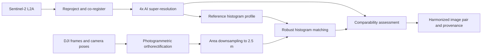

# Sentinel-2 and DJI Harmonization Example

This example defines two independent geospatial workflows that produce imagery on the same analysis grid for side-by-side photo interpretation. The workflows exchange files through explicit contracts, so they can run locally with CWL or remotely with REANA.

Presentation summary: [Geospatial Building Block Harmonization v2](geospatial-building-block-harmonization-v2.pptx). The original [Sentinel-2 and DJI Harmonization Architecture](sentinel2-dji-harmonization-architecture.pptx) filename is refreshed with the same content for compatibility. Regenerate both with `python3 scripts/generate_harmonization_slides.py` from the repository root.

The example target is RGB surface reflectance in `EPSG:32632` at 2.5 m ground sample distance. A deployment should choose the CRS, extent, resolution, bands, and reference acquisition for its area of interest.



## Workflow 1: Sentinel-2 Reference

Purpose: create the reference image and radiometric profile.

Inputs:

- `sentinel2_l2a` (File or STAC Item): B02, B03, and B04 surface-reflectance assets.
- `aoi` (GeoJSON File).
- `target_crs` (string), for example `EPSG:32632`.
- `target_resolution_m` (float), for example `2.5`.
- `super_resolution_model` (File): versioned TorchScript or ONNX model trained for Sentinel-2 reflectance.
- `model_card` (File): training domain, normalization, scale factor, licence, and validation metrics.
- `run_id` (string).

Steps:

1. Validate L2A processing level, cloud mask, band availability, nodata, scale, and acquisition metadata.
2. Reproject and co-register the already orthorectified Sentinel-2 bands to the declared target CRS and AOI.
3. Run 4x super-resolution from 10 m to 2.5 m while masking cloud/nodata pixels. The current executable loads the scene into memory; production-scale deployment should add overlapped tiled inference.
4. Calculate a per-band reference profile from valid overlap pixels using 256-bin histograms and the 2nd, 50th, and 98th percentiles.
5. Publish the image, profile, model identity, quality report, STAC metadata, and provenance.

Outputs:

- `sentinel2_harmonized.tif`: tiled Cloud Optimized GeoTIFF on the target grid.
- `reference_histogram.json`: band order, bins, counts, quantiles, valid range, nodata, and sample count.
- `target_grid.json`: CRS, affine transform, width, height, resolution, extent, and pixel alignment.
- `sentinel2_quality.json`: cloud coverage, nodata coverage, registration residuals, and model validation reference.
- `sentinel2_stac_item.json` and `sentinel2_provenance.json`.

The super-resolved image must be labelled as a derived interpretation product. It does not acquire true 2.5 m optical resolution, and the original 10 m data must remain linked in provenance.

## Workflow 2: DJI Comparison Image

Purpose: create a DJI image with the same geometry and a comparable visual response.

Inputs:

- `dji_images` (File[]): radiometrically suitable source frames.
- `camera_calibration` (File).
- `camera_poses` (File), from RTK/PPK or bundle adjustment.
- `dem_or_dsm` (File).
- `ground_control_points` (File?): optional but recommended.
- `target_grid` (File): output of Workflow 1.
- `reference_histogram` (File): output of Workflow 1.
- `run_id` (string).

Steps:

1. Build the camera model, tie points, dense surface, and orthomosaic with a photogrammetry engine such as OpenDroneMap.
2. Assess horizontal residuals against independent checkpoints; fail if the configured threshold is exceeded.
3. Warp to the exact Sentinel-2 target grid and downsample with an area/average kernel and antialiasing.
4. Match each RGB band to the Sentinel-2 reference over cloud-free, shadow-screened overlap pixels. Use clipped quantile mapping rather than unconstrained global equalization.
5. Publish the image, before/after histograms, quality report, STAC metadata, and provenance.

Outputs:

- `dji_harmonized.tif`: Cloud Optimized GeoTIFF with the same grid and band order as `sentinel2_harmonized.tif`.
- `dji_histograms.json`: source, downsampled, and matched distributions.
- `dji_quality.json`: checkpoint RMSE, overlap count, clipping fraction, and histogram distances.
- `dji_stac_item.json` and `dji_provenance.json`.

Downsampling should normally be deterministic area aggregation, not an AI model. AI is appropriate for Sentinel-2 super-resolution; using a learned model merely to discard DJI resolution makes validation and spectral traceability worse. An AI quality model may still select sharp, well-exposed source frames before orthorectification.

## Shared Contract

The second workflow must copy, not independently recreate, `target_grid.json`. Both final rasters must satisfy:

- identical CRS, affine transform, width, height, extent, resolution, band order, dtype, and nodata value;
- RGB values expressed in the same declared range, preferably unitless surface reflectance in `[0, 1]`;
- masks for cloud, shadow, saturation, and invalid pixels retained as separate assets;
- acquisition timestamps and sun/view geometry retained because histogram matching cannot remove temporal or illumination differences;
- model checksum, model card, inference parameters, source checksums, software/container digests, and processing activities recorded in provenance.

Example `target_grid.json`:

```json
{
  "crs": "EPSG:32632",
  "resolution": [2.5, -2.5],
  "extent": [500000.0, 4510000.0, 505000.0, 4515000.0],
  "width": 2000,
  "height": 2000,
  "band_order": ["red", "green", "blue"],
  "dtype": "float32",
  "nodata": -9999.0
}
```

Example histogram contract:

```json
{
  "method": "masked-quantile-reference",
  "bins": 256,
  "valid_range": [0.0, 1.0],
  "bands": {
    "red": {"quantiles": {"p02": 0.031, "p50": 0.184, "p98": 0.612}},
    "green": {"quantiles": {"p02": 0.028, "p50": 0.207, "p98": 0.655}},
    "blue": {"quantiles": {"p02": 0.041, "p50": 0.221, "p98": 0.701}}
  }
}
```

## Comparability Gate

The pair is accepted for photo interpretation only when all configured checks pass:

| Check | Example threshold |
|---|---:|
| Pixel-grid equality | exact |
| Independent checkpoint RMSE | less than 1 target pixel |
| Valid common overlap | at least 10,000 pixels |
| Per-band Jensen-Shannon distance after matching | at most 0.10 |
| Clipped pixels after matching | at most 1% |
| Cloud/shadow contamination in comparison mask | at most 5% |

These thresholds are examples, not universal accuracy claims. The quality report should include both before/after histogram distance and spatial registration metrics; similar histograms alone do not establish that images are geometrically or semantically comparable.

## Executable CWL Package

The shared workspace contains two validated entry points:

```text
workflows/imagery_harmonization/
|-- sentinel2-workflow.cwl
|-- dji-workflow.cwl
|-- reana-sentinel2.yaml
|-- reana-dji.yaml
|-- requirements.txt
|-- run_demo.py
|-- steps/
|   |-- process-sentinel2.cwl
|   |-- process-dji.cwl
|   `-- assess-comparability.cwl
|-- scripts/
|   |-- raster_contracts.py
|   |-- process_sentinel2.py
|   |-- process_dji.py
|   `-- assess_comparability.py
`-- examples/
    |-- generate_demo_inputs.py
    |-- sentinel2-inputs.yml
    |-- dji-inputs.yml
    `-- model-card-template.json
```

Install and execute both workflows through cwltool:

```bash
cd workflows/imagery_harmonization
python3 -m pip install -r requirements.txt
python3 run_demo.py
```

The deterministic fixture run produces two 256 x 256 COGs on the same 2.5 m grid. Its current measured worst-band Jensen-Shannon distance is approximately 0.138 before matching and 0.0043 after matching, with 65,536 common pixels and zero clipping.

`bicubic-demo` is the default example mode and is not represented as AI. Set `method: torchscript` and supply a trained model plus model card for operational super-resolution. The executable validates a `[1, 3, H, W]` input/output contract, scale-derived target resolution, and records the model checksum. The repository does not bundle an unvalidated trained model.

The DJI workflow accepts an orthomosaic, not unprocessed frames. Generate the orthomosaic and checkpoint RMSE through ODM/WebODM or equivalent photogrammetry, then provide them to the workflow. For REANA, download or persist `sentinel2_harmonized.tif`, `reference_histogram.json`, and `target_grid.json` from the first run and upload them as declared inputs to the second run.

## Building Block Mapping

| Capability | Building Block responsibility | Evidence |
|---|---|---|
| Input adaptation | Resolve STAC/CWL files and validate imagery metadata | validation report |
| Geometric correction | Orthorectification, reprojection, and co-registration | residuals and target grid |
| AI enhancement | Versioned Sentinel-2 super-resolution inference | model card, checksum, and inference parameters |
| Scale harmonization | Area downsampling to the shared grid | resampling method and scale ratio |
| Radiometric harmonization | Masked robust histogram matching | before/after profiles and clipping rate |
| Quality assessment | Geometry, histogram, mask, and provenance gates | machine-readable quality report |
| Publication | Typed COG/STAC outputs and provenance links | STAC Items and W3C PROV bundle |

This design fits the kernel's functional contract: each workflow declares input semantics and algorithm identity, emits typed outputs, and preserves execution evidence without making model-specific fields mandatory for every Building Block.